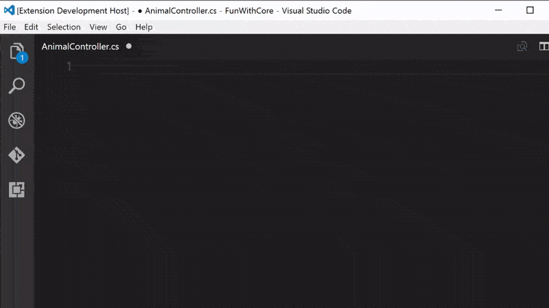
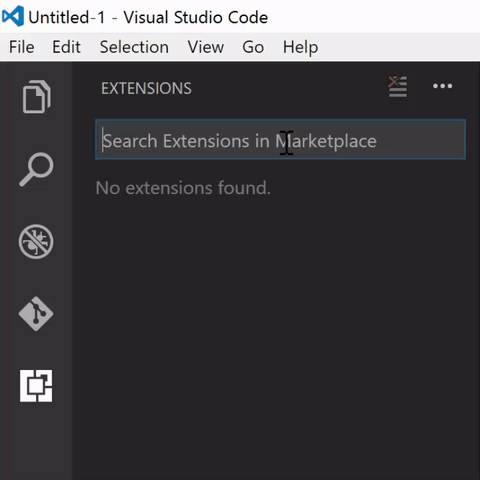

# wilderminds-aspnetcore-snippets

This is a set of snippets for use with Visual Studio Code for ASP.NET Core development.

## Features

A set of snippets including:

### C# Snippets:

- **mvc6-action**: Creates an MVC6 Action that returns a view.
- **mvc6-get**: Creates an MVC6 Action that Implements a basic GET.
- **mvc6-post**: Creates an MVC6 Action that Implements a basic POST.
- **mvc6-put**: Creates an MVC6 Action that Implements a basic PUT.
- **mvc6-delete**: Creates an MVC6 Action that Implements a basic DELETE.

- **mvc6-action-async**: Creates an async MVC6 Action that returns a view.
- **mvc6-get-async**: Creates an async MVC6 Action that Implements a basic GET.
- **mvc6-post-async**: Creates an async MVC6 Action that Implements a basic POST.
- **mvc6-put-async**: Creates an async MVC6 Action that Implements a basic PUT.
- **mvc6-delete-async**: Creates an async MVC6 Action that Implements a basic DELETE.

- **mvc6-controller**: Creates an MVC6 Controller for views.
- **mvc6-apicontroller**: Creates an MVC6 Controller for an API that implements all four basic verbs.

- **ef-dbcontext**: Creates an Entity Framework Core DbContext class.

### Razor Snippets:

- **razor-inject**: Generates an @inject block.
- **razor-environment**: Generates an environment block.
- **razor-raw**: Generates an @Html.Raw block.

## Installation

You can install it from the marketplace: http://shawnw.me/aspnetcoresnippets

Or you can use the Extensions manager:

## Installation

You can install the extension by visiting the store at:

- https://marketplace.visualstudio.com/items?itemName=wilderminds.wilderminds-aspnetcore-snippets

Or just typing this command in VS Core:

    ext install wilderminds-aspnetcore-snippets

## Source Code

Source code is at http://github.com/shawnwildermuth/aspnetcore-snippets

Please fork and send me pull requests for any additions you'd like to have!
